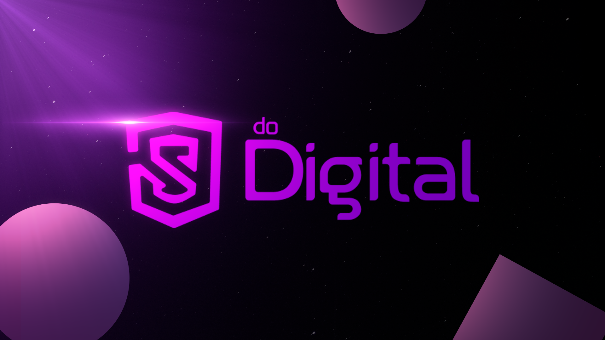

# n8n-nodes-digital-market-nodes

📕 Esse repositório contém o conjunto de integrações de api que contém as ferramentas indispensáveis para quem vende na internet.

🤩 E foram construídas para dar performance e escala para aqueles que usam o Javascript como principal arma de vendas.

😎 Faça você também parte da comunidade que está utilizando do javascript para revolucionar no marketing digital.

> 🔗 acesso: https://jsdodigital.manuelantun.es

> 🎁 Concorra a um pix de R$ 500,00: https://jsdodigital.manuelantun.es/n8n

## Instalando

Na sua instancia do n8n, acesse a aba de gerenciamento de pacotes e adicione o seguinte endereço:

```bash
n8n-nodes-digital-market-nodes
```

* E pronto! serão adicionados todos os nós disponíveis.

## Pacote de nós atuais

- [x] [Kiwify](https://kiwify.com.br)
- [x] [Evermart](https://evermart.com.br)
- [x] [Monetizze](https://monetizze.com.br)
- [x] [Plugchat](https://plugchat.com.br)


# Contribuindo
* Install n8n with:
	```
	npm install n8n -g
	```
* Recommended: follow n8n's guide to [set up your development environment](https://docs.n8n.io/integrations/creating-nodes/build/node-development-environment/).


## Using this starter

These are the basic steps for working with the starter. For detailed guidance on creating and publishing nodes, refer to the [documentation](https://docs.n8n.io/integrations/creating-nodes/).

1. [Generate a new repository](https://github.com/n8n-io/n8n-nodes-starter/generate) from this template repository.
2. Clone your new repo:
    ```
    git clone https://github.com/<your organization>/<your-repo-name>.git
    ```
3. Run `npm i` to install dependencies.
4. Open the project in your editor.
5. Browse the examples in `/nodes` and `/credentials`. Modify the examples, or replace them with your own nodes.
6. Update the `package.json` to match your details.
7. Run `npm run lint` to check for errors or `npm run lintfix` to automatically fix errors when possible.
8. Test your node locally. Refer to [Run your node locally](https://docs.n8n.io/integrations/creating-nodes/test/run-node-locally/) for guidance.
9. Replace this README with documentation for your node. Use the [README_TEMPLATE](README_TEMPLATE.md) to get started.
10. Update the LICENSE file to use your details.
11. [Publish](https://docs.npmjs.com/packages-and-modules/contributing-packages-to-the-registry) your package to npm.

## More information

Refer to our [documentation on creating nodes](https://docs.n8n.io/integrations/creating-nodes/) for detailed information on building your own nodes.

## License

[MIT](https://github.com/n8n-io/n8n-nodes-starter/blob/master/LICENSE.md)
